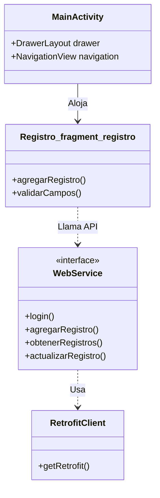

# SIMA Parking Mobile App


> **Aplicación Nativa Android para Operaciones.** Esta app permite al personal de campo registrar vehículos, calcular tarifas de salida y verificar la disponibilidad de espacios directamente desde sus smartphones utilizando una interfaz Material Design.

---

### 👤 Autor
**Creado por Diego Rivera**

[Ver Código en GitHub](https://github.com/dariverap/utparking-android-java) | [🇺🇸 English Version](./README.md)

---

## 🏗 Arquitectura

### Árbol del Proyecto
```bash
app/src/main/
├── java/com/example/finalproyect/
│   ├── WebService.java       # Definición de Interfaz Retrofit
│   ├── RetrofitClient.java   # Patrón Singleton para Networking
│   ├── login/                # Lógica Auth (Activity, Request/Response)
│   ├── registro/             # Lógica Parqueo (Fragments, Adapters)
│   ├── tarifa/               # Lógica Precios
│   └── MainActivity.java     # Contenedor de Navegación
└── res/
    ├── layout/               # Definiciones UI XML
    └── drawable/             # Recursos & Iconos Vectoriales
```

### Diagrama de Interacción de Clases
La app sigue una arquitectura MVC estándar de Android utilizando Fragmentos para diferentes módulos funcionales, comunicándose con el backend vía Retrofit.



---

## 🛠 Stack Tecnológico

*   **Plataforma:** Android (Min SDK 26, Target SDK 33)
*   **Lenguaje:** Java
*   **Networking:** Retrofit 2 + Gson Converter
*   **Componentes UI:** Material Design, AnimatedBottomBar, FancyToast
*   **Navegación:** FragmentManager, DrawerLayout

---

## 🔌 Integración API

La app se comunica con el backend vía `WebService.java`. Ejemplo de interfaz:

```java
@POST("/registro/add")
Call<String> agregarRegistro(@Body Registro registro);

@GET("/registro/{patente_vehiculo}")
Call<List<RegistroTarifa>> obtenerRegistro(@Path("patente_vehiculo") String patente_vehiculo);
```

---

## 🚀 Instalación

1.  **Abrir en Android Studio:**
    *   File -> Open -> Seleccionar la carpeta `mobile` (o la carpeta raíz que contiene `build.gradle`).

2.  **Sincronizar Gradle:**
    *   Permitir que Android Studio descargue las dependencias listadas en `build.gradle`.

3.  **Configurar URL del Backend:**
    *   Asegurar que `RetrofitClient.java` apunte a la `BASE_URL` correcta.
    ```java
    static final String BASE_URL = "https://utparking-api.onrender.com";
    ```

4.  **Ejecutar:**
    *   Conectar un dispositivo o iniciar un emulador.
    *   Click en "Run 'app'".
