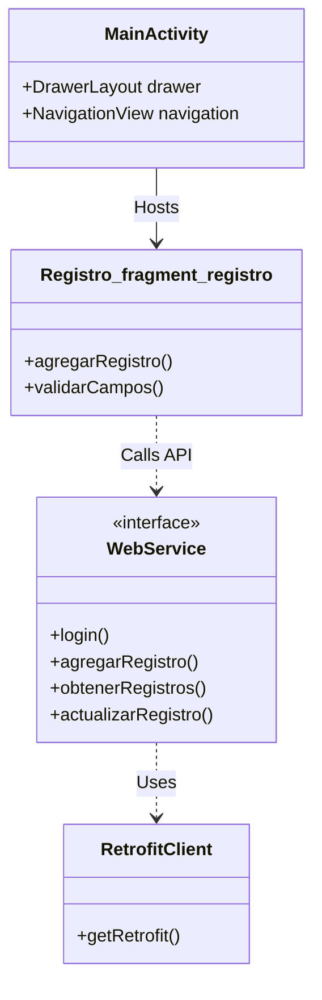

# SIMA Parking Mobile App


> **Native Android Application for Operations.** This app allows field staff to register vehicles, calculate tariffs upon exit, and check parking space availability directly from their smartphones using a Material Design interface.

---

### 👤 Author
**Created by Diego Rivera**

[View Code on GitHub](https://github.com/dariverap/utparking-android-java) | [🇪🇸 Versión en Español](./README.es.md)

---

## 🏗 Architecture

### Project Tree
```bash
app/src/main/
├── java/com/example/finalproyect/
│   ├── WebService.java       # Retrofit Interface Definition
│   ├── RetrofitClient.java   # Singleton Pattern for Networking
│   ├── login/                # Auth logic (Activity, Request/Response)
│   ├── registro/             # Parking logic (Fragments, Adapters)
│   ├── tarifa/               # Pricing logic
│   └── MainActivity.java     # Navigation Container
└── res/
    ├── layout/               # XML UI Definitions
    └── drawable/             # Assets & Vector Icons
```

### Class Interaction Diagram
The app follows a standard Android MVC architecture using Fragments for different functional modules, communicating with the backend via Retrofit.



---

## 🛠 Tech Stack

*   **Platform:** Android (Min SDK 26, Target SDK 33)
*   **Language:** Java
*   **Networking:** Retrofit 2 + Gson Converter
*   **UI Components:** Material Design, AnimatedBottomBar, FancyToast
*   **Navigation:** FragmentManager, DrawerLayout

---

## 🔌 API Integration

The app communicates with the backend via `WebService.java`. Example interface:

```java
@POST("/registro/add")
Call<String> agregarRegistro(@Body Registro registro);

@GET("/registro/{patente_vehiculo}")
Call<List<RegistroTarifa>> obtenerRegistro(@Path("patente_vehiculo") String patente_vehiculo);
```

---

## 🚀 Installation

1.  **Open in Android Studio:**
    *   File -> Open -> Select the `mobile` folder (or the root folder containing `build.gradle`).

2.  **Sync Gradle:**
    *   Allow Android Studio to download dependencies listed in `build.gradle`.

3.  **Configure Backend URL:**
    *   Ensure `RetrofitClient.java` points to the correct `BASE_URL`.
    ```java
    static final String BASE_URL = "https://utparking-api.onrender.com";
    ```

4.  **Run:**
    *   Connect a device or start an emulator.
    *   Click "Run 'app'".
